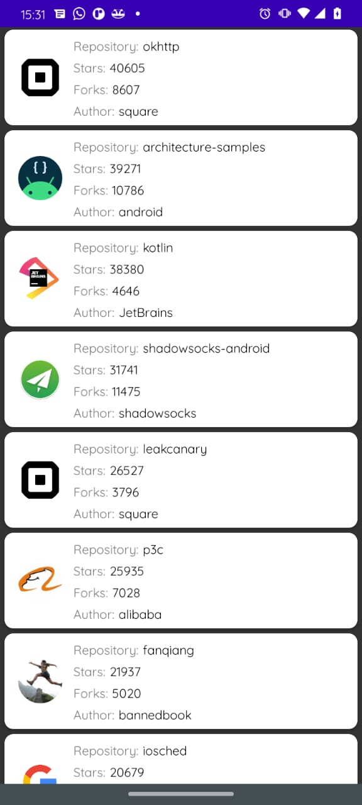

<h1 align="center">
    
</h1>

 

## 🧪 Tecnologias

Esse projeto foi desenvolvido com as seguintes tecnologias:

- [Android](https://reactjs.org)
- [Kotlin](https://reactjs.org)

## 💻 Projeto

Objetivo de listar os repositórios do github e exibir algumas informações relacionadas a eles.

